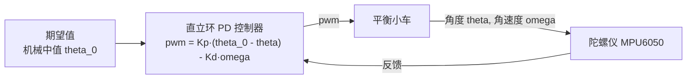
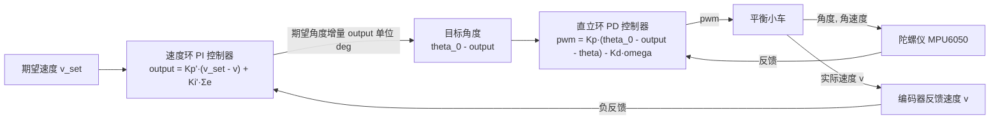
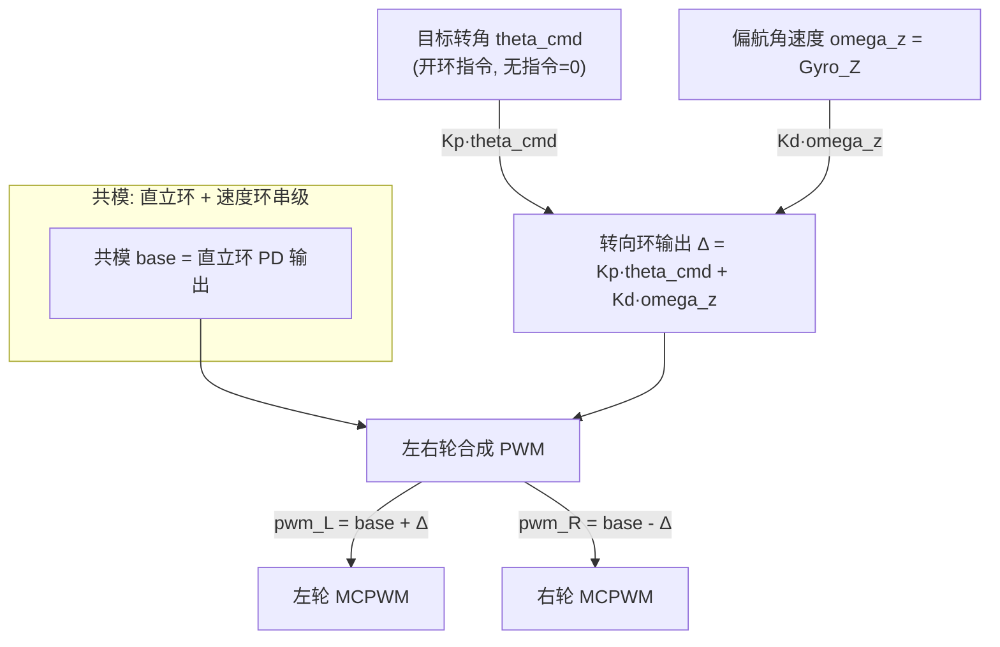

# 两轮自平衡车笔记

## 目录

- [两轮自平衡车笔记](#两轮自平衡车笔记)
  - [目录](#目录)
  - [电机基础](#电机基础)
    - [0.1 直流有刷电机基本方程](#01-直流有刷电机基本方程)
    - [0.2 机械特性与转矩转速曲线](#02-机械特性与转矩转速曲线)
    - [0.3 减速箱与扭矩转速换算](#03-减速箱与扭矩转速换算)
    - [0.4 平衡车对电机的需求推导](#04-平衡车对电机的需求推导)
      - [0.4.1 模型与受力分析](#041-模型与受力分析)
      - [0.4.2 扶正条件：加速度需求](#042-扶正条件加速度需求)
      - [0.4.3 执行器供给：加速度上限](#043-执行器供给加速度上限)
      - [0.4.4 可恢复的最大倾角](#044-可恢复的最大倾角)
    - [0.5 选型实战：读懂厂家参数表并定减速比](#05-选型实战读懂厂家参数表并定减速比)
      - [0.5.1 完整参数表（JGA25-370-0660，6 V）](#051-完整参数表jga25-370-06606-v)
      - [0.5.2 先判断：这张厂表规范吗？](#052-先判断这张厂表规范吗)
      - [0.5.3 读表只抓 3 个量，其余可忽略](#053-读表只抓-3-个量其余可忽略)
      - [0.5.4 用 0.4 公式反推所需堵转扭矩（算例）](#054-用-04-公式反推所需堵转扭矩算例)
      - [0.5.5 社区经验判据](#055-社区经验判据)
      - [0.5.6 算例结论与调档建议](#056-算例结论与调档建议)
  - [直立环](#直立环)
    - [1. 控制理论](#1-控制理论)
      - [1.1 PD 控制回路](#11-pd-控制回路)
      - [1.2 标准 PID 公式](#12-标准-pid-公式)
      - [1.3 化简为 PD](#13-化简为-pd)
      - [1.4 误差与微分项](#14-误差与微分项)
      - [1.5 最终直立环公式](#15-最终直立环公式)
      - [1.6 变量与符号约定](#16-变量与符号约定)
    - [2. 固件工程实现](#2-固件工程实现)
      - [2.1 核心算法](#21-核心算法)
      - [2.2 引脚与节拍](#22-引脚与节拍)
      - [2.3 串口命令](#23-串口命令)
      - [2.4 状态机与安全](#24-状态机与安全)
  - [速度环](#速度环)
    - [3. 控制理论](#3-控制理论)
      - [3.1 PI 控制回路](#31-pi-控制回路)
      - [3.2 PI 控制回路公式推导](#32-pi-控制回路公式推导)
      - [3.3 串级控制公式推导](#33-串级控制公式推导)
    - [4. 固件工程实现](#4-固件工程实现)
      - [4.1 核心算法](#41-核心算法)
      - [4.2 串口命令](#42-串口命令)
      - [4.3 状态机与安全](#43-状态机与安全)
  - [转向环](#转向环)
    - [5. 控制理论](#5-控制理论)
      - [5.1 差速转向运动学](#51-差速转向运动学)
      - [5.2 差模叠加](#52-差模叠加)
      - [5.3 转向控制律](#53-转向控制律)
      - [5.4 传感器选型与航向精度](#54-传感器选型与航向精度)
      - [5.5 纯差速转向的可行性](#55-纯差速转向的可行性)
    - [6. 固件工程实现](#6-固件工程实现)
      - [6.1 核心算法](#61-核心算法)
      - [6.2 串口命令](#62-串口命令)
      - [6.3 状态机与安全](#63-状态机与安全)
  - [无线操控（micro-ROS + WiFi）](#无线操控micro-ros--wifi)
    - [7. 设计](#7-设计)
      - [7.1 话题约定与指令限幅](#71-话题约定与指令限幅)
      - [7.2 转向控制：开环目标转角](#72-转向控制开环目标转角)
      - [7.3 并发模型与安全](#73-并发模型与安全)
    - [8. 固件工程实现](#8-固件工程实现)
      - [8.1 工程配置与依赖](#81-工程配置与依赖)
      - [8.2 初始化与数据流](#82-初始化与数据流)
      - [8.3 上位机操作步骤](#83-上位机操作步骤)
      - [8.4 调参与联调要点](#84-调参与联调要点)
  - [调参指南（总纲）](#调参指南总纲)
    - [总原则](#总原则)
    - [调参总顺序](#调参总顺序)
    - [直立环整定](#直立环整定)
    - [速度环整定](#速度环整定)
    - [转向环整定](#转向环整定)
    - [现象对照速查表](#现象对照速查表)
    - [排障记录](#排障记录)
      - [记录 1：电池供电不足](#记录-1电池供电不足)
      - [记录 2：Kd 高频尖叫并自晃倒](#记录-2kd-高频尖叫并自晃倒)
      - [记录 3：平放一直前进](#记录-3平放一直前进)
      - [记录 4：速度环限幅饱和致速度打满（Kp 与限幅失配）](#记录-4速度环限幅饱和致速度打满kp-与限幅失配)
      - [记录 5：转向环阻尼项符号反（正反馈发散）](#记录-5转向环阻尼项符号反正反馈发散)
    - [安全提示](#安全提示)

在鱼香 ROS 差速底盘（`fishbot_motion_control`）基础上加装 MPU6050，拆下从动轮，整车退化为一级倒立摆，通过电机闭环控制实现两轮自平衡。

本文档按控制环组织，遵循"先控制理论数学模型，再实际代码工程实现"的顺序书写。当前已完成直立环（`test10_upright`）、速度环（`test11_speed`）、转向环（`test12_turn`）的控制理论与固件，并在 `test13_balance` 中通过 micro-ROS + WiFi 实现无线键盘遥控（`/cmd_vel`）。

---

## 电机基础

本章给出直流减速电机的物理基础与选型推导，明确"执行器能力"这一先于控制算法的前提：若电机在饱和输出下仍不足以提供回正力矩，任何 PID 调参都无法救回倒下的车体。

### 0.1 直流有刷电机基本方程

直流有刷电机由电枢回路与机械输出两部分构成，稳态下满足以下方程。

电压平衡方程（电枢回路）：

$$
U = I R + E
$$

其中 $U$ 为端电压、$I$ 为电枢电流、$R$ 为电枢电阻、$E$ 为反电动势。

反电动势（法拉第定律）与转速成正比：

$$
E = K_e \omega
$$

电磁转矩（安培力）与电流成正比：

$$
T = K_t I
$$

其中 $K_e$ 为反电动势常数、$K_t$ 为转矩常数。当二者采用同一单位制（SI）时，有 $K_t = K_e$，可由能量守恒 $EI = T\omega$ 两侧消去 $I\omega$ 直接得到。

### 0.2 机械特性与转矩转速曲线

由 0.1 三式消去 $I$、$E$，得到直流电机的 **机械特性** ——转矩与转速的线性关系：

$$
T(\omega) = \frac{K_t U}{R} - \frac{K_t K_e}{R}\omega
$$

引入两个特征点：

- **堵转扭矩** （$\omega = 0$）：$T_{stall} = \dfrac{K_t U}{R}$；
- **空载转速** （$T = 0$）：$\omega_{noload} = \dfrac{U}{K_e}$。

于是机械特性可写作更直观的形式：

$$
T(\omega) = T_{stall}\left(1 - \frac{\omega}{\omega_{noload}}\right)
$$

**关键结论** ：直流电机转速越高、可用转矩越小，空载转速处转矩归零。因此平衡车被推倒时若轮子高速滚动，电机实际可提供的回正力矩趋近于零——"全速追"恰恰是转矩最弱的状态。

### 0.3 减速箱与扭矩转速换算

先看 0.1、0.2 推导出的 **电机本体** 特性：以即将用到的 370 有刷直流电机为例，6V 下空载约 6000 rpm，但额定转矩只有零点几 kg·cm、堵转也就几 kg·cm—— **转速极高、转矩极小** 。而 0.4 将看到，平衡车恰恰相反，需要的是 **低速、大力矩** 。这两者直接矛盾，减速箱就是解决矛盾的部件：以牺牲转速为代价换取转矩。

设电机本体转速为 $\omega_{in}$、转矩为 $T_{in}$，输出轴转速为 $\omega_{out}$、转矩为 $T_{out}$，减速比定义为输入与输出转速之比：

$$
i = \frac{\omega_{in}}{\omega_{out}}
$$

**转速关系** 由齿轮啮合决定，输出轴转得慢 $i$ 倍：

$$
\omega_{out} = \frac{\omega_{in}}{i}
$$

**转矩关系** 由功率守恒推出：理想减速箱不产生也不消耗能量，输入机械功率恒等于输出机械功率（$P = T\omega$）：

$$
P_{in} = T_{in}\omega_{in} = P_{out} = T_{out}\omega_{out}
$$

把 $\omega_{out} = \omega_{in}/i$ 代入上式，$\omega_{in}$ 消去，即得理想输出转矩：

$$
T_{out} = T_{in} \cdot i
$$

但实际齿轮啮合存在摩擦损耗（正齿轮效率 $\eta \approx 0.7 \sim 0.9$），故 **实际输出转矩** 为：

$$
T_{out} = T_{in} \cdot i \cdot \eta
$$

**两个结论，务必成对记忆** ：

- **此消彼长** ：$\omega_{out}$ 缩小 $i$ 倍，$T_{out}$ 放大约 $i\eta$ 倍——同一个电机本体，减速比越大，输出转速越低、输出转矩越大（这正是 0.5 表格里"转速递减、转矩递增"的原因）；
- **功率守恒** ：无论减速比多少，输出功率 $P_{out} = T_{out}\omega_{out} \approx T_{in}\omega_{in} = P_{in}$ 几乎不变（只损失效率 $\eta$）。因此同一本体在不同减速比下 **额定输出功率近似恒定** （0.5 表格中功率列恒为 2.7W，即此理）。

平衡车对转矩的需求远高于转速（见 0.4），故应 **优先选大减速比档位** ；具体选多大，正是 0.5 要解决的实战问题。

### 0.4 平衡车对电机的需求推导

0.3 告诉我们"减速比越大输出转矩越大"，但 **到底需要多大转矩** ？这一节把平衡车抽象成车轮上的倒立摆，从力矩平衡出发推导——这是选型的核心依据（0.5 会据此查表）。

#### 0.4.1 模型与受力分析

把车体简化为一个 **点质量 $m$、绕轮轴转动的倒立摆** ：质心位于轮轴正上方、距轮轴 $l$。车体偏离竖直 $\theta$ 时，作用于质心的力有两个：

1. **重力 $mg$** ：竖直向下，其绕轮轴的力臂为 $l\sin\theta$，产生使车体 **倾倒** 的力矩：
   $$
   M_g = m g \cdot l \sin\theta
   $$
2. **轮子加速带来的惯性力 $ma$** ：若轮子以加速度 $a$ 追赶车体，则车体相对轮轴产生一个水平方向的惯性力 $ma$（方向与 $a$ 相反），其绕轮轴的力臂为 $l\cos\theta$，产生 **扶正** 的力矩：
   $$
   M_a = m a \cdot l \cos\theta
   $$

#### 0.4.2 扶正条件：加速度需求

要车体不倾倒（临界扶正），须扶正力矩 $\ge$ 倾倒力矩：

$$
M_a \ge M_g
\quad\Longrightarrow\quad
m a l \cos\theta \ge m g l \sin\theta
$$

两侧同时消去 $m l$，得 **运动学上的扶正条件** ：

$$
a \ge g \tan\theta
$$

注意 $l$ 被消去了—— **结论与质心高度无关** ，只取决于倾角。这就是"车被推偏 $\theta$ 后，轮子必须提供至少 $g\tan\theta$ 的水平加速度才能救回"的由来。

#### 0.4.3 执行器供给：加速度上限

加速度 $a$ 来自电机输出转矩。两轮各自以输出转矩 $T_{out}$ 经轮半径 $r$ 转化为轮缘推力 $F = T_{out}/r$，两轮合计推动整车质量 $m$：

$$
a = \frac{2 T_{out}}{m r}
$$

由 0.2 机械特性知：救回车体发生在 **低速乃至静止** 的瞬间，此时可用转矩接近堵转扭矩，故取 $T_{out} \approx T_{stall}$ 得 **最大可提供加速度** ：

$$
a_{max} = \frac{2 T_{stall}}{m r}
$$

#### 0.4.4 可恢复的最大倾角

令"供给 $\ge$ 需求"（$a_{max} \ge g\tan\theta$），解出执行器能力决定的 **可恢复倾角上限** ：

$$
\theta_{max} = \arctan\left(\frac{a_{max}}{g}\right)
= \arctan\left(\frac{2 T_{stall}}{m g r}\right)
$$

**把 0.4.1~0.4.3 串起来看：小车被推了一下之后，会发生什么** 。稳态直立时 $\theta \approx 0$，维持直立只需很小的转矩；突发的推挤让车体瞬间获得一个偏角 $\theta_0$，PID 立即满负荷输出，轮子以接近堵转的转矩全力加速去追车体。此时只有两种结局：

- 若 $\theta_0 \le \theta_{max}$：$a_{max} \ge g\tan\theta_0$，轮子追得上，倾角被压回零，小车 **被救回** ；
- 若 $\theta_0 > \theta_{max}$：即使 PID 输出已饱和到 100%，轮子的最大加速度 $a_{max}$ 仍小于重力分量 $g\tan\theta_0$，车体加速度不够，倾角只会越倒越快，直至倒下—— **必倒，且与算法参数无关** 。

### 0.5 选型实战：读懂厂家参数表并定减速比

前面 0.1~0.4 建立了物理框架，这一节把它落实到"选型"：给你一张厂家参数表，如何判断它能不能信、该抓哪几个数、怎么用 0.4 的公式反推所需扭矩，最后落到选哪一档减速比。下面以一款常见的 6V 入门减速电机——JGA25-370（370 本体 + JGA25 金属减速箱），并选取减速比 1:35（即 `35.5K` 档）——作为贯穿全程的算例，把每一步完整走一遍。

#### 0.5.1 完整参数表（JGA25-370-0660，6 V）

照抄所选算例 JGA25-370-0660 的厂家官方产品参数表（全部 11 档，含电流与结构列）：

| 减速比 | 空载转速 rpm | 空载电流 A | 额定转速 rpm | 额定扭矩 kg·cm | 额定电流 A | 功率 W | 堵转扭矩 kg·cm | 堵转电流 A | 齿轮箱长 mm | 重量 g |
| ------ | ------------ | ---------- | ------------ | -------------- | ---------- | ------ | -------------- | ---------- | ----------- | ------ |
| 4.4    | 1360         | 0.10       | 1000         | 0.10           | 0.45       | 2.7    | 0.35           | 2.0        | 17          | 100    |
| 9.6    | 620          | 0.10       | 450          | 0.22           | 0.45       | 2.7    | 0.75           | 2.0        | 17          | 100    |
| 21.3   | 280          | 0.10       | 220          | 0.50           | 0.45       | 2.7    | 1.70           | 2.0        | 19          | 100    |
| 35     | 170          | 0.10       | 130          | 0.82           | 0.45       | 2.7    | 2.80           | 2.0        | 21          | 105    |
| 45     | 130          | 0.10       | 100          | 1.00           | 0.45       | 2.7    | 3.60           | 2.0        | 23          | 105    |
| 78     | 77           | 0.10       | 60           | 2.00           | 0.45       | 2.7    | 6.20           | 2.0        | 23          | 105    |
| 103    | 60           | 0.10       | 46           | 2.70           | 0.45       | 2.7    | 8.20           | 2.0        | 23          | 105    |
| 171    | 35           | 0.10       | 27           | 4.00           | 0.45       | 2.7    | 12.00          | 2.0        | 25          | 110    |
| 226    | 26           | 0.10       | 20           | 5.00           | 0.45       | 2.7    | 15.00          | 2.0        | 25          | 110    |
| 377    | 16           | 0.10       | 12           | 8.00           | 0.45       | 2.7    | 24.00          | 2.0        | 27          | 110    |
| 500    | 12           | 0.10       | 9            | 9.00           | 0.45       | 2.7    | 27.00          | 2.0        | 27          | 110    |

注：电流列中空载 0.1 A、额定 0.45 A、堵转 2.0 A 为同系列通用值，各档位相同。

#### 0.5.2 先判断：这张厂表规范吗？

拿到任何一张电机表，先别急着读数，花 30 秒判断它的可信度（以 0.5.1 的 JGA25-370-0660 产品参数表为例）：

- **三态是否齐全** ：合格的表应同时给出 **空载（No-Load）/ 额定（Rated Load）/ 堵转（Stall）** 三种工况——空载定转速上限、额定定长期工作点、堵转定峰值能力（0.4 用到它）。本表三态齐全，符合行业微型减速电机常规；
- **堵转电流是否显著大于额定电流** ：表中堵转 2.0 A ≫ 额定 0.45 A，符合电磁特性（堵转时反电动势 $\to 0$、电流达峰值），可信；
- **同一本体、额定功率是否近似恒定** ：各档恒为 2.7 W，正是 0.3 功率守恒的体现——减速箱不改变本体额定功率，属规范做法；
- **档位与电压编码** ：型号 `0660` 表示 6 V + 6000 rpm 本体；同一型号标多档减速比、只改转速/扭矩，是标准系列化表。

**结论** ：此表符合行业规范，可直接使用。易踩的坑是——表中扭矩已是"带上减速箱后的输出轴扭矩"（0.3 的 $T_{out}=T_{in}\cdot i\cdot\eta$），选型直接查它即可，别再把它当电机本体的值。

#### 0.5.3 读表只抓 3 个量，其余可忽略

参数表列很多，但 **选型只需 3 个量** ，其余（电流、重量、长度）只作电源与安装核对。映射关系如下：

| 表格列   | 对应物理量 | 公式变量          | 选型用途                             |
| -------- | ---------- | ----------------- | ------------------------------------ |
| 空载转速 | 转速上限   | $\omega_{noload}$ | 0.2 特性右端点，决定"追重心"速度上限 |
| 额定扭矩 | 长期工作点 | $T_{rated}$       | 能否持续驱动（发热/寿命），取工作点  |
| 堵转扭矩 | 峰值能力   | $T_{stall}$       | 0.4 的 $\theta_{max}$，本文最关键    |

**为什么堵转扭矩最关键** ：救回车体发生在"轮子近静止、需最大推力"的瞬间（0.2 特性左端），此时可用转矩就是堵转扭矩。额定扭矩只决定"匀速运行时会不会过热"，不决定"能不能救回"——判断"被推一下救不救得回"要看堵转扭矩，而非额定扭矩。

#### 0.5.4 用 0.4 公式反推所需堵转扭矩（算例）

选型的核心是 **反向计算** ：先定"希望扛住多大的推偏角"，再反推需最小堵转扭矩。流程：

1. **量参数** ：整车质量 $m$（kg）、轮半径 $r$（m，轮径一半）；
2. **定目标** ：希望被推偏多少度仍能救回，记为 $\theta_{max}$；
3. **反推** ：由 0.4 得 $T_{stall} \ge \dfrac{m \cdot g \cdot r \cdot \tan\theta_{max}}{2}$（单位 N·m，注意 $1\ \text{kg·cm} = 0.098\ \text{N·m}$）；
4. **查表对照** ：把算出的 $T_{stall}$ 与 0.5.1 表"堵转扭矩"列对比，选"≥ 算得值且留 1.5~2 倍裕量"的最小档位。

**算例** （量级演示）：取 $m \approx 1\ \text{kg}$、$r \approx 0.033\ \text{m}$、目标 $\theta_{max} = 25^\circ$：

$$
\tan 25^\circ \approx 0.466,\quad
T_{stall} \ge \frac{1 \times 9.8 \times 0.033 \times 0.466}{2} \approx 0.075\ \text{N·m} \approx 0.77\ \text{kg·cm}
$$

**重要警示：不要把 0.77 直接拿去下单！** 0.4 的平动刚体模型给出的是 **理想下限** ，真实平衡车因下列因素需显著放大：

- **动态而非静态** ：救回发生在车体已有角速度时，等效需求高于静态倾角算出的值；
- **传动效率** ：输出扭矩已按 $\eta$ 打折（0.3），实际推力不足；
- **扰动容错与控制裕度** ：需抵抗振动、地面不平、齿轮间隙、编码器死区与响应延时；
- **供电跌落** ：电池供电不足会进一步压缩峰值扭矩（见排障记录 1）。

工程上社区普遍按 **放大 3~5 倍以上** 选型，或直接用下一小节的社区经验判据，而不是拿理想下限做决定。

#### 0.5.5 社区经验判据

由于理论下限过于乐观，平衡车社区（DIY 教程、厂商选型指南）普遍采用一套务实判据，与理论互补印证：

- **扭矩快速估算** ：$T_{stall}\approx m\times r$（$T_{stall}$：所需堵转扭矩；$m$：整车重量；$r$：车轮半径；`kg·cm` 直接用 kg 与 cm 相乘，即 $m$、$r$ 分别以 kg、cm 计）。例如 $m=1\ \mathrm{kg}$、$r=3\ \mathrm{cm}$ 时 $T_{stall}\approx 3\ \mathrm{kg\cdot cm}$（建议堵转扭矩最好超过这个值）；
- **减速比区间** ：两轮自平衡常用 **1:30 ~ 1:50**（认为此区间最能平衡速度与扭矩、避免"扭矩不足导致小车抖动"）；另有教程建议 **1:120** 或 **接近 200~300 rpm** 的空载转速；

**综合判据** （本文档推荐）：选"堵转扭矩 ≥ 3~6 kg·cm、额定扭矩 ≥ 1 kg·cm、空载转速落在 60~200 rpm"的档位，再按实际小车的 $m$、$r$ 微调。

#### 0.5.6 算例结论与调档建议

回到 0.5.4 的算例（$m \approx 1\ \text{kg}$、轮半径约 3.3 cm），若起始就选 1:35 档：

- 1:35 档 **空载 170 rpm、额定扭矩 0.82 kg·cm、堵转 2.8 kg·cm** 。按 0.4 理想下限（约 0.77 kg·cm）看似够，但按社区判据（$m\times r\approx 3.3\ \mathrm{kg\cdot cm}$，$m$ 整车重量、$r$ 轮半径，以 kg、cm 计）则明显不足——堵转扭矩储备只到临界线附近、无裕量。此类配置的典型表现是：小幅扰动能稳住，但被大一点的力一推就救不回（对照 0.4.4 的"$\theta_0 > \theta_{max}$"分支）；
- **推荐调档** ：换同系列 **1:45**（堵转 3.6 kg·cm）或 **1:78**（堵转 6.2 kg·cm、额定 2.0 kg·cm）均可——扭矩提升 1.3~2.2 倍、空载 60~130 rpm 仍够追重心速度，属社区经验区间内；轮径更大或车更重时选 1:78，追求更敏捷选 1:45；
- **提示** ：JGA25-370 不同减速比档位仅改减速箱/成品，出轴、安装孔位与编码器接口同系列通用， **代码无需改动** ；换档后只需按总纲重新整定参数。

---

## 直立环

直立环是两轮自平衡的基础环，负责抵消重力矩使车体在竖直方向稳定。因为倒立摆天然不稳定，且不施加控制时偏离竖直的角度会指数发散，所以直立环必须快速响应。

### 1. 控制理论

#### 1.1 PD 控制回路

小车直立需要一个快速响应，并且倒立摆模型中小车受到地球重力影响几乎不可能产生稳态误差：因为小车只要没有达到机械中值就会倾倒, 无需不断积累误差, 所以这里直接省略掉积分控制。下图是 PD 直立环的控制回路。



- 期望值：机械中值 $\theta_0$，即车体能保持平衡时的倾角
- 被控量：陀螺仪返回的实际角度 $\theta$ 与角速度 $\omega$
- 控制器：比例 + 微分

**机械中值** ：因为受小车组装等移位影响，小车的真实平衡位置可能不是 0 度，需要自行测试小车平衡时的倾角。此角度才是我们期望的角度。

#### 1.2 标准 PID 公式

通过控制回路写出如下公式，标准 PID 为：

$$
u_k = K_p \cdot e_k + K_i \cdot \sum_{j=0}^{k} e_j + K_d \cdot (e_k - e_{k-1})
$$

#### 1.3 化简为 PD

直立环只取比例控制和微分控制，因此公式简化为：

$$
u_k = K_p \cdot e_k + K_d \cdot (e_k - e_{k-1})
$$

#### 1.4 误差与微分项

定义误差为机械中值与陀螺仪实际角度之差：

$$
e_k = \theta_0 - \theta \qquad (\text{误差值} = \text{机械中值} - \text{陀螺仪返回实际角度值})
$$

求误差差分：

$$
e_k - e_{k-1}
$$

$$
e_k = \theta_0 - \theta_k
$$

$$
e_{k-1} = \theta_0 - \theta_{k-1}
$$

$$
e_k - e_{k-1} = (\theta_0 - \theta_k) - (\theta_0 - \theta_{k-1}) = \theta_{k-1} - \theta_k = -(\theta_k - \theta_{k-1})
$$

于是误差差分与角位移是 **相反数** 关系。相邻两拍的角度增量（角位移）等于角速度乘以采样周期：$\theta_k - \theta_{k-1} = \omega \cdot T$，故：

$$
e_k - e_{k-1} = -\omega \cdot T \qquad (\omega:\text{陀螺仪角速度}, T:\text{控制周期})
$$

**为何直接采用角速度** ：控制是离散的，每间隔固定周期 $T$ 计算一次。严格说微分项应为 $K_d \cdot (e_k - e_{k-1}) = K_d \cdot (-\omega T) = -(K_d\,T)\,\omega$。因为 $T$ 是常数，整定 $K_d$ 时会把 $T$ 一并吸收进系数（等效到每单位角速度），故微分项只与角速度 $\omega$ 成比例。于是代码无需每拍计算误差差分，直接取陀螺仪输出的角速度 $\omega$ 作为微分输入——D 项取 $-\omega$（负号并入 $K_d$），既省运算，又规避对含噪角度做差分造成的噪声放大。注意并入后系数与采样周期耦合，改动控制周期须重新整定（见调参总则"一次只动一个参数"）。

#### 1.5 最终直立环公式

将上面的公式整合（注意微分项由误差差分推导出的是 $-\omega$，故 $K_d$ 项系数为负）得到实际的 PD 公式：

$$
\mathrm{PWM} = K_p \cdot (\theta_0 - \theta) - K_d \cdot \omega
$$

#### 1.6 变量与符号约定

先约定坐标方向：车体前进方向为 $x$ 负方向，故前倾时 MPU6050 `getAngleY` 读出负值。代码直接采用传感器原始读数作为控制量（`theta = getAngleY()`、`omega = getGyroY()`），下表 $\theta$/$\omega$ 即传感器读数，坐标统一后倾为正（前倾为负）。PID 库契约（误差 = 目标 − 实际，微分项取 − 角速度）保持不变。

| 符号       | 代码变量         | 含义                         | 来源                      |
| ---------- | ---------------- | ---------------------------- | ------------------------- |
| $\theta_0$ | `zero_pitch_deg` | 机械中值（期望倾角）         | 人工实测（`'c'` 标定）    |
| $\theta$   | `theta`          | 控制俯仰角（后倾为正）       | `theta = mpu.getAngleY()` |
| $\omega$   | `omega`          | 控制角速度（后倾方向为正）   | `omega = mpu.getGyroY()`  |
| $K_p$      | `UPRIGHT_KP`     | 比例增益，单位 `PWM/deg`     | 待实测整定                |
| $K_d$      | `UPRIGHT_KD`     | 微分增益，单位 `PWM/(deg/s)` | 待实测整定                |

公式中的 $\theta$ 和 $\omega$ 即陀螺仪原始读数，$\theta_0$ 由我们手动测得。注意 $K_d$ 项系数为负（见 1.4 推导）, 因为误差差分 $e_k - e_{k-1}$ 等于 $-\omega$。

代码中该 D 项由 `PIDController::update_pwm_upright` 实现：其内部取 `d_error = -rate`（`rate` 即 $\omega$），代入 $u_k = K_p \cdot e_k + K_d \cdot d\_error$ 恰得 $K_p \cdot (\theta_0 - \theta) - K_d \cdot \omega$。

### 2. 固件工程实现

固件为 `src/tests/test10_upright`，仅实现直立环 PD。

#### 2.1 核心算法

直立环 PD 由 `PIDController` 库封装。核心是库方法 `update_pwm_upright`（纯 PD，D 项取角速度的相反数），先看库实现，再看工程调用。

**库实现** （`lib/PIDController/PIDController.cpp`）：

```cpp
// 外部微分: D 项 Δe 直接取角速度的相反数, 避免对含噪角度做差分 (见 1.4)
int16_t PIDController::update_pwm_upright(float target, const float inputs[2]) {
    float error = target - inputs[PID_INPUT_ANGLE];          // e = target - theta
    d_error_ = -inputs[PID_INPUT_ANGULAR_RATE];              // Δe = -omega (e_k - e_{k-1})
    float output = kp_ * error + kd_ * d_error_;             // u = Kp*e + Kd*Δe (纯 PD)
    output = std::fmax(-output_limit_, std::fmin(output_limit_, output)); // 输出限幅 ±limit
    return static_cast<int16_t>(output >= 0.0f ? output + 0.5f : output - 0.5f); // 四舍五入
}
```

参数约定：`target` 为期望角度（直立环目标，此处为机械中值 $\theta_0$；串级时为 $\theta_0$ 减速度环输出），`inputs[0]` 为角度 $\theta$（`PID_INPUT_ANGLE`）、`inputs[1]` 为角速度 $\omega$（`PID_INPUT_ANGULAR_RATE`）。代入得 $u = K_p(\theta_0-\theta) - K_d\omega$，与 1.5 公式一致。库层强制无 I 项，`update_pwm_upright` 忽略 `ki_` 不累加积分。

**工程调用** （`src/tests/test10_upright/main.cpp`）：`setup` 配置增益与限幅，之后每个 5 ms 控制周期读 IMU 后调用：

```cpp
// setup: 配置 P/I/D 增益与输出限幅 (直立环为纯 PD, 库层强制无 I 项, UPRIGHT_KI 仅占位)
balance_pid.update_pid(UPRIGHT_KP, UPRIGHT_KI, UPRIGHT_KD);
balance_pid.output_limit(UPRIGHT_PWM_LIMIT);

// 每 5ms 控制周期: 读 IMU 后直接调用库计算直立环输出
const float theta = mpu.getAngleY();  // 控制俯仰角(后倾为正): 直接采用传感器原始读数
const float omega = mpu.getGyroY();   // 控制角速度(后倾方向为正)

const float inputs[2] = { theta, omega };               // [角度, 角速度]
// update_pwm_upright: 目标角度直接入参 (此处为机械中值 theta_0)
const int16_t pwm_balance = balance_pid.update_pwm_upright(zero_pitch_deg, inputs); // = Kp*(theta_0 - theta) - Kd*omega
```

#### 2.2 引脚与节拍

| 项目     | 值          | 说明                                                  |
| -------- | ----------- | ----------------------------------------------------- |
| I2C SDA  | GPIO10      | 从空闲集合 {3,46,9,10,11,12} 避开 strapping 3/46 选取 |
| I2C SCL  | GPIO9       | 同上                                                  |
| 控制节拍 | 5ms (200Hz) | FreeRTOS 任务 `vTaskDelayUntil` 固定周期，钉 core1    |
| 串口     | 115200      | 命令输入 + 状态文本输出（纯 ASCII）                   |

#### 2.3 串口命令

| 命令 | 功能             | 说明                                      |
| ---- | ---------------- | ----------------------------------------- |
| `s`  | 启停武装切换     | 武装后姿态进入中值窗口才真正起控          |
| `c`  | 机械中值在线标定 | 扶直静止后发送，取 0.2s 平均 `theta` 生效 |

#### 2.4 状态机与安全

- 上电默认 `kIdle` 停止，消除"平放上电误起控"问题（见排障记录 3）；
- 起控条件：已武装 且 $|\theta - \theta_0| < 8^\circ$；
- 倒地保护：$|\theta - \theta_0| > 45^\circ$ 自动解除武装并停机，扶正后可重新起控。

---

## 速度环

速度环负责控制小车前后运动速度。目标：给定期望速度（编码器反馈 + PI 控制），通过调整直立环的平衡点角度来驱动小车，而不是直接调 PWM。串级 PID 结构下，速度环为 **外环** ，其输出作为直立环（内环）的期望角度输入。

### 3. 控制理论

#### 3.1 PI 控制回路

速度调节过程中希望速度变化平缓且连续，因此舍去易受噪声干扰的微分控制（D 项），以防高频振动现象产生。速度环采用 **PI 控制器** ，与直立环构成串级 PID：外环为速度环，速度环的输出作为内环（直立环）的输入，内环直接作用到驱动器；这里外环的输出值表示 **期望的角度值** 。

信号流向如下：



1. 给定 **期望速度** $v_{set}$（目标编码器速度）；
2. 与 **编码器反馈速度** $v$ 相减得误差 $e_k = v_{set} - v$；
3. 速度环 PI 控制器输出 `output`（期望角度增量）；
4. 机械中值 $\theta_0$ 减去 `output`，作为直立环 PD 控制器的输入（期望角度）；
5. 直立环输出 PWM 直接作用到驱动器。

#### 3.2 PI 控制回路公式推导

通过控制回路写出如下公式，标准 PID：

$$
u_k = K_p \cdot e_k + K_i \cdot \sum_{j=0}^{k} e_j + K_d \cdot (e_k - e_{k-1})
$$

速度环只取比例控制与积分控制（舍去微分，见 3.1），因此公式简化为：

$$
u_k = K_p' \cdot e_k + K_i' \cdot \sum_{j=0}^{k} e_j
$$

定义速度误差为期望速度与实际速度之差：

$$
e_k = v_{set} - v \qquad (\text{误差值} = \text{期望速度} - \text{实际速度})
$$

将上面的公式整合得到实际的 PI 公式（速度环）：

$$
\mathrm{output} = K_p' \cdot (v_{set} - v) + K_i' \cdot \sum_{j=0}^{k} e_j
$$

#### 3.3 串级控制公式推导

将速度环与直立环串联，推导完整控制公式。

① 直立环：

$$
\mathrm{PWM} = K_p \cdot (\theta_0 - \theta) - K_d \cdot \omega
$$

② 速度环（见 3.2）：

$$
\mathrm{output} = K_p' \cdot (v_{set} - v) + K_i' \cdot \sum_{j=0}^{k} e_j
$$

③ 将 $\theta_0 - \mathrm{output}$ 作为直立环的输入代入①。推导分三步：

- **误差符号** ：速度环误差 $e = v_{set} - v$（目标 − 实际）。未武装时按 `'+'` 设正 $v_{set}$（含义：要求前进），再按 `'w'` 开启运动后目标生效，起步瞬间 $v = 0$，故 $e = v_{set} - 0 > 0$，输出 $\mathrm{output} = K_p'\cdot e + K_i'\cdot\sum e_j > 0$。`output` 量纲是 **期望角度增量（deg）** ，不是 PWM。
- **物理机制** ：平衡车无法像普通车那样"直接加大 PWM 就加速"。要让车前进，必须先让车身 **向前倾斜** ——车体前倾时直立环误差 $\theta_0 - \theta > 0$，持续输出正 PWM 让轮子向前追（防倒），前倾角越大"追"的力度越大、前向加速度越大。故"想加速"等价于"把直立环目标角往 **前倾方向** 调"。
- **符号代入** ：方向约定下前倾为负方向（`theta` 减小，见 1.6），`output > 0` 表示"需要更前倾"，因此新目标角为机械中值 **减去** 增量：$\theta_0 - \mathrm{output}$。用其替换①中的固定 $\theta_0$：

$$
\mathrm{PWM} = K_p \cdot \left( (\theta_0 - \mathrm{output}) - \theta \right) - K_d \cdot \omega
$$

④ 将上式展开并代回速度环，得到双环完整公式：

$$
\mathrm{PWM} = K_p \cdot \theta_0 - K_p \cdot \left[ K_p' \cdot (v_{set} - v) + K_i' \cdot \sum_{j=0}^{k} e_j \right] - K_p \cdot \theta - K_d \cdot \omega
$$

展开后的绿色部分正是速度环项（负号已并入），红色部分正是直立环项：

$$
\mathrm{PWM} = \underbrace{- K_p \cdot K_p' \cdot (v_{set} - v) - K_p \cdot K_i' \cdot \sum_{j=0}^{k} e_j}_{\color{green}{\text{速度环项}}} + \underbrace{K_p \cdot \theta_0 - K_p \cdot \theta - K_d \cdot \omega}_{\color{red}\text{直立环项}}
$$

因此这个双环 PID 的控制代码，相当于把速度环项（取负号后）与直立环项求和后传入电机驱动器。

### 4. 固件工程实现

速度环固件为 `src/tests/test11_speed`，在 `test10_upright` 直立环基础上新增编码器测速与速度环 PI，构成串级。

#### 4.1 核心算法

速度环（外环，PI）经 `PIDController::update_pwm_speed` 计算，输出期望角度增量；机械中值减去该输出作为直立环目标角度，交由 `update_pwm_upright`（内环，纯 PD）实现串级。先看库实现，再看工程调用。

**库实现** （`lib/PIDController/PIDController.cpp`）：

```cpp
int16_t PIDController::update_pwm_speed(float target, float measurement) {
    float error = target - measurement;                        // e_k = v_set - v
    error_sum_ += error;
    error_sum_ = std::fmax(-INTEGRAL_SUP_LIMIT, std::fmin(INTEGRAL_SUP_LIMIT, error_sum_)); // 积分限幅
    float output = kp_ * error + ki_ * error_sum_;             // u = Kp*e + Ki'*Σe (纯 PI)
    output = std::fmax(-output_limit_, std::fmin(output_limit_, output));                   // 输出限幅
    return static_cast<int16_t>(output >= 0.0f ? output + 0.5f : output - 0.5f);            // 四舍五入
}
```

参数约定：`target` 为期望速度 $v_{set}$，`measurement` 为编码器反馈速度 $v$。纯 PI 无 D 项（速度调节需平缓连续，舍去微分以防高频振动，见 3.1）。与 `update_pwm_upright` 为独立方法，串级嵌套在调用方实现，两方法类内互不调用。

**工程调用** （`src/tests/test11_speed/main.cpp`）：

```cpp
// setup: 配置速度环 PI (外环, 无 D 项) 与直立环 PD (内环, 库层强制纯 PD)
speed_pid.update_pid(SPEED_KP, SPEED_KI, SPEED_KD);
speed_pid.output_limit(SPEED_OUTPUT_LIMIT);
balance_pid.update_pid(UPRIGHT_KP, UPRIGHT_KI, UPRIGHT_KD);
balance_pid.output_limit(UPRIGHT_PWM_LIMIT);

// 每 5ms 控制周期: 读 IMU + 编码器测速 (运动学正解, 两轮平均, mm/s)
const float theta = mpu.getAngleY();       // 控制俯仰角(后倾为正): 直接采用传感器原始读数
const float omega = mpu.getGyroY();        // 控制角速度(后倾方向为正)
int32_t ticks[2] = {encoders[MOTOR_LEFT].getTicks(), encoders[MOTOR_RIGHT].getTicks()};
kinematics.update_motor_speed(millis(), ticks);          // 差值法测两轮转速
float motor_speeds[2] = {
    kinematics.get_motor_speed(MOTOR_LEFT),
    kinematics.get_motor_speed(MOTOR_RIGHT)
};
float body_vel[2] = {0.0f, 0.0f};
kinematics.kinematics_forward(motor_speeds, body_vel);  // 运动学正解 -> 车体速度
const float speed_mm_s = body_vel[VEL_LINEAR];           // 车体线速度 (mm/s), 速度环反馈

// 速度环 (外环, PI): output = Kp'*(v_set - v) + Ki'*Σe, 输出为期望角度增量 (deg)
const int16_t speed_output = speed_pid.update_pwm_speed(target_speed_mm_s, speed_mm_s);

// 串级嵌套: 直立环目标角度 = 机械中值 theta_0 - 速度环输出 (docs 3.3 公式 ③)
const float target_angle = zero_pitch_deg - static_cast<float>(speed_output);

// 直立环 (内环, PD): = Kp*(target_angle - theta) - Kd*omega
const float inputs[2] = { theta, omega }; // [角度, 角速度]
const int16_t pwm_balance = balance_pid.update_pwm_upright(target_angle, inputs);
```

#### 4.2 串口命令

| 命令 | 功能             | 说明                                                 |
| ---- | ---------------- | ---------------------------------------------------- |
| `s`  | 启停武装切换     | 同 test10                                            |
| `c`  | 机械中值在线标定 | 同 test10                                            |
| `+`  | 目标速度 +步进   | 仅未武装有效，`target_speed_mm_s += SPEED_STEP_MM_S` |
| `-`  | 目标速度 -步进   | 仅未武装有效，`target_speed_mm_s -= SPEED_STEP_MM_S` |
| `w`  | 运动往返开关     | 仅运行态有效，开→按设定速度运动，关→停止运动保持直立 |

#### 4.3 状态机与安全

与 test10 一致：上电默认 `kIdle`，`'s'` 武装后姿态进入中值窗口起控；起控瞬间运动使能 `motion_enabled` 清零（默认原地直立、速度环目标 0，即先验证纯直立），按 `'w'` 开启运动、再按一次停止运动但保持直立平衡。倒地保护 `|\theta - \theta_0| > 45^\circ` 自动停机。

---

## 转向环

转向环负责控制小车转向。目标：由 **开环转角指令** $\theta_{cmd}$ 驱动转向，同时以偏航角速度 $\omega_z$ 反馈提供 **阻尼镇定** ，通过左右轮差速量实现转向。

### 5. 控制理论

转向环控制 yaw 自由度（偏航角 $\psi$、偏航角速度 $\omega_z$），是 **差模量** ——只与左右轮速度差有关，不影响前进速度。它是一个 **单一完整转向环** ：

- 目标转角 $\theta_{cmd}$ 由 **开环指令** 给出（遥控/上位机步进或折算指令）， **无指令时为 0** ；
- 无指令（$\theta_{cmd}=0$）时转向环自动退化为 **走直线阻尼** $\Delta = K_d\,\omega_z$，抑制两电机个体差异、负载不均造成的自发偏航（$\omega_z \to 0$）——"抑制转向"是目标转角为 0 时的固有行为，而非独立模式；
- 有指令（$\theta_{cmd}\neq 0$）时转向环同时输出 **指令驱动项** （$\propto \theta_{cmd}$）与 **阻尼项** （$\propto \omega_z$），让车转向且不发散。

#### 5.1 差速转向运动学

两轮小车，$v_L$、$v_R$ 为左右轮速度（mm/s），$L$ 为轮距：

$$
v = \frac{v_L + v_R}{2}, \qquad \omega_z = \dot\psi = \frac{v_R - v_L}{L}
$$

转向的本质是给左右轮施加 **对称差速量** 而不改变平均速度 $v$。运动学逆解：

$$
v_L = v - \omega_z \cdot \frac{L}{2}, \qquad v_R = v + \omega_z \cdot \frac{L}{2}
$$

#### 5.2 差模叠加

平衡车车体是刚体，倾角（pitch）是两轮共享的单一状态量，因此 **平衡与前进只能共模控制** （两轮同方向）；转向是唯一可以"两轮分开"的自由度，天然为差模（见 5.5）。控制结构上，转向环与直立环、速度环并行，输出以差模形式叠加在共模输出上：

$$
pwm_L = base + \Delta, \qquad pwm_R = base - \Delta
$$

其中 $base$ 为共模部分，$\Delta$ 为转向差速量。等价展开为业界三环统一写法：

$$
pwm_L = balance + speed + turn, \qquad pwm_R = balance + speed - turn
$$

- `balance`：直立环 PD 输出（共模，两轮同号）；
- `speed`：速度环输出（共模）；
- `turn`：转向环输出（差模，两轮异号）。

#### 5.3 转向控制律

转向环输出差速量 $\Delta$ 为 **两项之和** ：

$$
\Delta = K_p \cdot \theta_{cmd} + K_d \cdot \omega_z
$$

- **指令项** $K_p\,\theta_{cmd}$：开环转角指令驱动。$\theta_{cmd}$ 为目标转角，来自遥控/上位机开环指令；无指令时为 0，该项为零；
- **阻尼项** $+K_d\,\omega_z$：偏航角速度负反馈（纯 D 本质）。$\omega_z = \mathrm{Gyro\_Z}$ 为陀螺瞬时角速度，不依赖积分。



两种极限情形说明"合并"语义：

- **无指令** （$\theta_{cmd}=0$）：$\Delta = K_d\,\omega_z$，即旧"抑制转向（走直线）"——目标转角为 0 是该环的默认状态，而非独立模式；
- **有指令** （$\theta_{cmd}\neq 0$）：驱动项使车转向，阻尼项同步抑制超调与自发偏航，即旧"开环转动"叠加上阻尼。

若未来需要"转到精确航向并停住"的闭环，只需把指令项改为位置误差 $\Delta = K_p(\theta_{cmd}-\psi) + K_d\,\dot\psi$；但 $\psi$ 需要可靠的外部航向（见 5.4），故当前保留开环指令形式。

#### 5.4 传感器选型与航向精度

**MPU6050（六轴）对转向环的适用性** ：

- $\mathrm{Gyro\_Z}$（Z 轴角速度）：陀螺瞬时测量、不积分， **无累积漂移** ，完全适用于阻尼项 $\Delta = K_d\,\omega_z$（旧"模式 A 抑制转向"），也适用于闭环精确航向的阻尼项；
- $\mathrm{Angle\_Z}$（Z 轴角度）：`MPU6050_light` 中为纯积分 `angleZ += gyroZ*dt`，无修正源——加速度计只能感知重力方向，无法分辨绕重力轴的 yaw（绕 Z 轴旋转不改变重力投影），故 **必然线性漂移** ，仅数秒至数十秒可用；
- 换用 DMP 亦然：yaw 无外部参考，任何算法都无法精确恢复绝对航向。

| 判断                                       | 结论                                                    | 依据                                                                                                     |
| ------------------------------------------ | ------------------------------------------------------- | -------------------------------------------------------------------------------------------------------- |
| 6050 能否精确描述航向                      | 不能。属传感器信息缺失（无磁力计/GPS）而非固件问题      | 六轴无绝对航向参考，yaw 只能陀螺积分，数学上不可精确恢复                                                 |
| 6050 换 9250 是否可靠                      | 仅提供"可能可靠"前提，需满足校准/安装/融合/环境四个条件 | 磁力计未校准误差 ±5°，12 点椭球拟合后约 ±0.5°；温度漂移约每 2 小时需重校准；对电机磁场、大电流干扰极敏感 |
| 走直线阻尼（无指令直行）是否需更高精度器件 | 不需要                                                  | 阻尼项只用角速度，6050 已足够；9250 收益仅在闭环精确航向时才体现                                         |

#### 5.5 纯差速转向的可行性

**纯差速转向可行** ，与 `test05_Kinematics` / `test08_Publisher` 的 `cmd_vel.angular.z → 运动学逆解 → 左右轮独立速度跟踪` 同构。但平衡车上的实现形式不同：平衡车没有独立的左右轮速度环，转向以差模量 $\Delta$ 直接叠加到直立环输出（见 5.2），而非修改两轮目标速度。

**开环差速转向的固有代价** ：

- 走不直：同 PWM 不等于同转速（电机制造公差、机械阻力、重量分布、电压跌落）——"开环差速的不听话是物理本质决定的，不是代码 bug"；
- 转不准：转角靠"时间近似"而非"角度测量"，单次误差小但会累积（如方形轨迹变成螺旋）；
- 平衡车特有：$\Delta$ 过大超出直立环调节能力会破坏平衡（尤其原地转）。

**为何不采用"两个独立速度环"** ：两轮各自闭环会通过共享的车体倾角隐式耦合——左环加速、右环减速会压斜车体、迫使直立环响应，三环互相打架。故业界采用"共模速度环 + 差模转向环"解耦结构：pitch 共享只能共模，yaw 差模独立成环，各环带宽逐级降低。

### 6. 固件工程实现

转向环固件为 `src/tests/test12_turn`，在 `test11_speed` 基础上新增差模转向环并行，输出以对称差速量叠加进左右轮。

#### 6.1 核心算法

转向环为 `PIDController` 独立实例 `turn_pid`，其输出 $\Delta$ 以差模形式叠加到共模输出（直立环 + 速度环）上。转向控制使用 **单一专用库方法**  `update_pwm_turn`，一次调用同时完成指令项与阻尼项，无模式切换。先看库实现，再看工程调用。

**库实现** （`lib/PIDController/PIDController.cpp`）：

```cpp
// 单一完整转向环: Δ = kp·θ_cmd + kd·ωz
//   θ_cmd  目标转角 (开环指令, 无指令=0); 指令项 kp·θ_cmd 驱动转向
//   ωz     偏航角速度 Gyro_Z; 阻尼项 kd·ωz 纯 D (无指令时单独作用 = 走直线抑制)
//   无积分, ki 恒 0 占位
int16_t PIDController::update_pwm_turn(float target_cmd, float omega_z) {
    float output = kp_ * target_cmd + kd_ * omega_z;
    output = std::fmax(-output_limit_, std::fmin(output_limit_, output)); // 输出限幅
    return static_cast<int16_t>(output >= 0.0f ? output + 0.5f : output - 0.5f);
}
```

配置在 `configure_turn_pid` 中装载 **一组** 完整三元组（命名风格同速度环 `SPEED_KP/SPEED_KI/SPEED_KD`）：`TURN_KP`（指令项系数）、`TURN_KD`（阻尼系数）、`TURN_KI` 恒 0 占位，输出限幅统一为 `TURN_PWM_LIMIT`。

**工程调用** （`src/tests/test12_turn/main.cpp`）：

```cpp
void configure_turn_pid() {
    turn_pid.reset();
    turn_pid.update_pid(TURN_KP, TURN_KI, TURN_KD); // 单一转向环三元组 (无模式)
    turn_pid.output_limit(TURN_PWM_LIMIT);
}

// 每 5ms 控制周期: 共模串级同 test11, 另取 Z 轴角速度与目标转角作差模输入
const float omega_z = mpu.getGyroZ();

// 差模: 单一转向环 Δ (docs 5.3); 目标转角 turn_target_angle_deg 无指令时保持 0
const int16_t pwm_delta = turn_pid.update_pwm_turn(turn_target_angle_deg, omega_z);

// 合成: 共模 base + 差模 Δ 对称叠加 (docs 5.2); int 域求和避免 int16 提升窄化告警
const int16_t pwm_left = static_cast<int16_t>(static_cast<int>(pwm_balance) + pwm_delta);
const int16_t pwm_right = static_cast<int16_t>(static_cast<int>(pwm_balance) - pwm_delta);
motor.updateMotorSpeed(MOTOR_LEFT, pwm_left);
motor.updateMotorSpeed(MOTOR_RIGHT, pwm_right);
```

这里省略了共模串级（速度环 `update_pwm_speed` → 直立环 `update_pwm_upright`）细节，与 4.1 一致；`pwm_balance` 即共模串级输出。`turn_target_angle_deg` 初值 0，仅 `'l'`/`'r'` 步进修改、`'o'` 归零（见 6.2）。

#### 6.2 串口命令

| 命令 | 功能             | 说明                                                                       |
| ---- | ---------------- | -------------------------------------------------------------------------- |
| `s`  | 启停武装切换     | 同 test11                                                                  |
| `c`  | 机械中值在线标定 | 同 test11                                                                  |
| `+`  | 目标速度 +步进   | 仅未武装有效，`target_speed_mm_s += SPEED_STEP_MM_S`                       |
| `-`  | 目标速度 -步进   | 仅未武装有效，`target_speed_mm_s -= SPEED_STEP_MM_S`                       |
| `w`  | 运动往返开关     | 仅运行态有效，开→按设定速度运动，关→停止运动保持直立（不影响转向差模）     |
| `l`  | 目标转角 -步进   | `turn_target_angle_deg -= TURN_ANGLE_STEP_DEG`（左转为负）；转向环即时响应 |
| `r`  | 目标转角 +步进   | `turn_target_angle_deg += TURN_ANGLE_STEP_DEG`；转向环即时响应             |
| `o`  | 目标转角归零     | `turn_target_angle_deg = 0`，转向环仅剩阻尼项，恢复直行                    |

#### 6.3 状态机与安全

与 test11 一致：上电默认 `kIdle`，`'s'` 武装后姿态进入中值窗口起控；转向环仅在 `kRunning` 内生效（`kIdle` 下输出关闭），倒地保护 `|\theta - \theta_0| > 45^\circ` 自动停机。转向相关状态仅保留一项：`turn_target_angle_deg`（目标转角，上电为 0 = 直行；`'o'` 归零或改向时重新赋值，不再有模式切换）。运动使能 `motion_enabled` 与 test11 相同（`'w'` 往返开关），且与转向差模独立：运动关闭时仍可原地转向调试。

---

## 无线操控（micro-ROS + WiFi）

test12 的串口遥控（`'+'`/`'-'` 定速、`w` 启停、`l`/`r` 目标转角步进）受线缆长度与实时性限制。`test13_balance` 在 test12 控制核心基础上引入 micro-ROS 与 WiFi，将指令通道迁移到 ROS2 话题 `/cmd_vel` 与 `/balance_enable`，由上位机 `teleop_twist_keyboard` 键盘遥控，实现真正无线操控。

### 7. 设计

#### 7.1 话题约定与指令限幅

| 话题              | 类型                  | 字段        | 映射                                                                                     |
| ----------------- | --------------------- | ----------- | ---------------------------------------------------------------------------------------- |
| `/cmd_vel`        | `geometry_msgs/Twist` | `linear.x`  | 速度环目标 $v_{set}$（m/s → mm/s）                                                       |
| `/cmd_vel`        | `geometry_msgs/Twist` | `angular.z` | 开环转向指令 $\omega_{z,set}$（rad/s → deg/s，折算为目标转角指令后进单一转向环，见 7.2） |
| `/balance_enable` | `std_msgs/Bool`       | `data`      | `true` 请求武装 / `false` 请求解除                                                       |

`teleop_twist_keyboard` 默认 `linear.x = 0.5 m/s`、`angular.z = 1.0 rad/s`，超出平衡车调节能力，固件侧限幅兜底：

$$
|v_{set}| \le \mathrm{CMD\_MAX\_LINEAR\_MM\_S} = 300\ \text{mm/s}, \quad |\omega_{z,set}| \le \mathrm{CMD\_MAX\_ANGULAR\_DEG\_S} = 150\ \text{deg/s}
$$

上位机亦可用 `--ros-args -p linear.x:=0.2` 主动降速。

#### 7.2 转向控制：开环目标转角

test13 与 test12 共用同一 **单一完整转向环** （docs 5.3 / 6.1）：$\Delta = K_p\,\theta_{cmd} + K_d\,\omega_z$，无模式切换。差异仅在目标转角 $\theta_{cmd}$ 的来源——test12 由串口 `'l'`/`'r'` 步进修改 `turn_target_angle_deg`；test13 将遥控角速度指令 $\omega_{z,set}$（rad/s → deg/s，限幅见 7.1） **折算为目标转角指令** 后写入同一变量：

$$
\theta_{cmd} = -\frac{K_d}{K_p} \cdot \omega_{z,set}
$$

式中 $-K_d/K_p$ 为折算系数（量纲 deg/(deg/s)=s）：由稳态 $\Delta = K_p\,\theta_{cmd} + K_d\,\omega_z = 0$ 得 $\theta_{cmd} = -(K_d/K_p)\,\omega_z$，令 $\omega_z=\omega_{z,set}$ 即上式——负号源于阻尼项取 $+K_d\,\omega_z$，保证稳态转向角速度 $\approx \omega_{z,set}$，遥杆手感与旧角速度伺服一致；同时保留同一环的阻尼项 $+K_d\,\omega_z$。

- **无指令** （teleop 松键发布全零 $\omega_{z,set}=0$）：$\theta_{cmd} = 0$，转向环退化为 $\Delta = K_d\,\omega_z$ 走直线阻尼，与 test12 松开 `'o'` 后的行为一致。
- **有指令** （$\omega_{z,set} \neq 0$）：$\theta_{cmd} \neq 0$，驱动项 $K_p\theta_{cmd}$ 使车转向，阻尼项同步镇定；

> 折算系数采用 $K_d/K_p$ 而非额外常量，是因为合并后两项共用一个控制器；若固件希望直接复用串口步进转角语义，也可令 $\theta_{cmd}$ 直接取遥控折算角，两种都走同一 `update_pwm_turn` 方法。

差模合成与限幅同 6.1（$pwm_L = base + \Delta$，$pwm_R = base - \Delta$）。

#### 7.3 并发模型与安全

- 通信与控制分核运行：`micro_ros_task`（默认核，优先级 1，executor 回调）经临界区写指令变量；`balance_task`（core1，优先级 5，5 ms/200 Hz 节拍）在临界区内读指令快照后执行三环控制。共享变量 `cmd_linear_mps` / `cmd_angular_rps` / `cmd_enable` 为跨核非原子 float，一律由 `portMUX_TYPE` 临界区保护，避免跨核数据竞争；
- 会话安全：micro-ROS Agent 断开（spin 返回错误）自动请求解除武装，防止失控时小车携带指令奔跑；
- 倒地保护沿用 test12：$|\theta - \theta_0| > 45^\circ$ 自动停机；
- 串口保留 `s`/`c` 作为调试后备（字符集与 test10/11/12 一致），无 WiFi/Agent 时仍可独立操控：`s` 武装/解除（等价翻转 `/balance_enable`），`c` 标定机械中值（仅 `kIdle` 生效，非阻塞逐周期采样）。

### 8. 固件工程实现

#### 8.1 工程配置与依赖

| 项             | 值                                                                                     |
| -------------- | -------------------------------------------------------------------------------------- |
| 环境           | `[env:test13_balance]`                                                                 |
| 源码过滤       | `build_src_filter = +<tests/test13_balance>`                                           |
| micro-ROS 传输 | `board_microros_transport = wifi`                                                      |
| 依赖库         | `Esp32McpwmMotor`、`Esp32PcntEncoder`、`MPU6050_light`、`micro_ros_platformio`、`WiFi` |

`platformio.ini` 公共段默认 `lib_ignore = micro_ros_platformio`（避免其他环境触发 micro-ROS 钩子），`test13_balance` 用空 `lib_ignore =` 覆盖解除，与主环境、`test06/07/08` 保持一致。

#### 8.2 初始化与数据流

- WiFi 与 Agent：`set_microros_wifi_transports(WIFI_SSID, WIFI_PASS, agent_ip, AGENT_PORT)`，Agent 地址由 `IPAddress.fromString(ROS_AGENT_IP)` 解析；
- micro-ROS：`rclc_support_init` → `rclc_node_init_default` → `rclc_executor_init`（2 个订阅句柄）→ 两个 best-effort 订阅（`/cmd_vel`、`/balance_enable`）→ `rclc_executor_spin`；
- 指令流：Twist 回调把 `linear.x`、`angular.z` 换算限幅后经临界区写入 `cmd_linear_mps` / `cmd_angular_rps`；Bool 回调把 `cmd_enable` 置位；`control_step` 每周期读快照后执行三环控制。

#### 8.3 上位机操作步骤

```bash
# 终端 1: 启动 micro-ROS Agent (UDP)
ros2 run micro_ros_agent micro_ros_agent udp4 --port 8888

# 终端 2: 武装
ros2 topic pub /balance_enable std_msgs/msg/Bool "{data: true}" -r 5

# 终端 3: 键盘遥控 (可加 --ros-args -p linear.x:=0.2 降速)
ros2 run teleop_twist_keyboard teleop_twist_keyboard
```

`i`/`j`/`k`/`l` 操控；teleop 松键自动发布全零，小车回归走直线阻尼；`ros2 topic pub /balance_enable std_msgs/msg/Bool "{data: false}" -r 5` 或关闭 Agent 即解除武装。

#### 8.4 调参与联调要点

1. 先确认 WiFi 连接与 Agent 握手：串口打印 `client connected` 表示传输层就绪，再发 `s` 或 `/balance_enable` 武装；
2. 无 Agent 时小车不可无线遥控，串口 `s`/`c` 后备仍可用；
3. 转向符号：若实测左右反向，对 `angular.z` 取负（差速符号校验见总纲转向环整定）；
4. 限幅参数在 `config.h` 无线操控区调整；`CMD_MAX_LINEAR_MM_S` 保守调低可减少起步横摆冲击。

---

## 调参指南（总纲）

本章集中收编各环的调参方法，参考社区平衡车串级 PID 调参经验（机械中值 → 直立环 → 速度环 → 转向环的整定顺序与现象判断法）总结而成。

### 总原则

1. **先极性、后大小** ：任何一环先确认反馈极性正确，再谈增益大小；
2. **先内环、后外环** ：直立环是内环，必须先稳定；速度环/转向环是外环，调参时以内环已稳定为前提；
3. **一次只动一个参数** ：每改一个量记录一组现象（角度趋势、抖动频率、行走方向），避免多变量同时改导致无法归因；
4. **从零/极小值起步** ：所有增益初始设 0 或极小值，逐个放开；

### 调参总顺序

| 阶段 | 目标                     | 关键操作                                                                                                        | 详见                             |
| ---- | ------------------------ | --------------------------------------------------------------------------------------------------------------- | -------------------------------- |
| 0    | 机械中值 $\theta_0$      | 双向临界角度取平均；本固件用 `'c'` 在线标定                                                                     | 直立环整定（命令见 2.3）         |
| 1    | 直立环 Kp 极性 → 大小    | 倾斜车体、轮转方向与倾斜一致（前倾轮向车头追）；增到低频抖动                                                    | 直立环整定                       |
| 2    | 直立环 Kd 极性 → 大小    | 现象同 Kp（向哪边倾轮向哪边追）；增到高频震荡记录临界值                                                         | 直立环整定                       |
| 3    | 速度环 Kp/Ki 极性 → 大小 | 先校验编码器相位（拨轮 speed 随动）；设 v_set=0 手拨轮应被抑制；增 Kp 至原地收敛，再设小目标速度按 `'w'` 验运动 | 速度环整定                       |
| 4    | 转向环极性 → 大小        | 先 Kd 走直线阻尼、后 Kp 步进转角（无指令/有指令两态验证，见 7.2）                                               | 转向环整定                       |
| 5    | 无线联调与限幅           | 限幅参数保守调低起步冲击                                                                                        | 8.4 调参与联调要点（命令见 8.3） |

### 直立环整定

按"先极性、后大小，先 Kp、后 Kd"的顺序，全程手扶、一次只动一个参数。操作序列总览： **Kd 置 0 → 升 Kp 至大幅低频抖动（临界）记值 → $K_p\times 0.6$ 回退 → 升 Kd 至高频尖叫前（临界）记值 → $K_d\times 0.6$ 回退** 。逐项说明如下。

- **观测与记录** ：调参全程以串口状态行为观测依据（test10 起每 100ms 输出一行，如 `state=RUN theta=1.23 omega=-0.45 pwm=12`，test11 追加 `motion`/`speed`/`target`，test12 再追加 `omega_z`/`delta` 等字段）；每调一个参数记录"现象 → 参数 → 结果"一组，现象判定对照本文档末尾现象速查表。

- **机械中值** ：双手扶车，从后往前缓慢倾斜到恰好向前倾倒，记角度 1；再从前往后倾斜到临界，记角度 2；取平均即 $\theta_0$。本固件亦可扶直静止发 `'c'` 自动标定。
- **Kp 极性** ：手扶车体前倾，轮子应向车头（前进）方向追；反则对调 `config.h` 中该电机 `PIN_A/PIN_B`（勿在代码里取负，见 1.6）。
- **整定 Kp 前先将 Kd 置 0** （Ziegler–Nichols 临界比例度法第一步，社区多来源一致）：调 Kp 阶段 `UPRIGHT_KD` 必须为 0，否则：
  - $K_d$ 是阻尼项，非零时会把 Kp 引发的振荡"压住"，临界振荡点被 **掩盖或后移** ——记录到的临界 Kp 偏大且现象模糊，0.6 回退系数随之失效；
  - 违反"一次只动一个参数"原则（总原则 3），Kp/Kd 同时变化导致现象无法归因。
- **Kp 大小** ：Kd=0 下从小到大增大。车体能明显回正不再软塌塌时为首档；继续增大至出现 **大幅低频抖动** ，记录该临界值后立即按社区经验系数回退（见下），定稿后再进入 Kd 阶段。
- **Kd 极性** ：单测 Kd 现象与 Kp 一致——向哪边倾倒，轮子向哪边转动；反之为极性错误。
- **Kd 大小** ：在已回退定稿的 Kp 基础上从小到大增加，直到出现 **高频震荡** （电机高频尖叫，抗干扰强且极易损坏电机；临界时小车可能把自己晃倒，属预期失稳信号而非极性错误，机理与对策见排障记录 2），立即断电，记录临界值后同样按 0.6 回退定稿。
- **社区经验系数** ：临界 Kp、Kd 各乘 **0.6** 作为安全起步值（示例：Kp 550→330，Kd 2.5→1.5），留出稳定裕度防止临界震荡。注意 **0.6 是起点而非唯一终值** （社区解析：0.6 属安全折中，可在此基础上找回刚性）：
  - 回退后手感"偏柔/没劲"是 **预期副作用而非调错** ——Kp 减小使直立回复力矩下降、Kd 同缩使阻尼变弱、收敛变慢，属"以柔换稳"；能稳定直立仅是手感偏柔即为正常（若轻碰即倒则属退过头，另行排查）；
  - 嫌软可在该基准上按 **5%~10% 步进** 上调 Kp（典型工作点可到临界值的 0.7~0.85）：出现"起始幅度小、逐渐变大"的低频摆动即已逼近临界， **退回上一次稳定值** ；
  - 加 P 后阻尼相对变弱，若出现低频缓摆则 Kd 同步 5%~10% 跟进；Kd 到顶判据仍是高频尖叫/抖动（见排障记录 2）；
  - 动态手感判据：轻推或掰偏 5~10° 松手， **快速回正且回摆不超过 1~2 次** 为刚性足且阻尼合适；回正迟缓"像面条"说明仍偏软，继续小幅上调；
  - 最终定稿可在"临界前最后稳定点"上再乘 **0.85~0.9** 保留约 15% 裕度，兼顾刚度与稳定。
- **（可选）工程妥协** ：若纯 P（Kd=0）下振荡发散过快、车体频繁拍倒撑不到临界，可先给约最终估值 1/10 的极小 Kd"保命"再升 Kp；代价是阻尼使临界点后移、观测到的临界 Kp 略偏大，属可接受的折中，定稿前记得将该 Kd 归零复测一次。

### 速度环整定

按"先极性、后大小，先 Kp、后 Ki"的顺序，全程手扶、一次只动一个参数；前置条件：直立环已整定稳定（见上节）。操作序列总览： **编码器相位校验 → v_set=0 手拨轮验 Kp 极性 → 升 Kp 至原地收敛 → 设小目标速度按 'w' 验运动收敛 → （漂移）调 Ki** 。逐项说明如下。

- **编码器相位校验** ：手拨其中一轮再松手，串口 `speed` 读数方向应随拨动方向变化。若拨动轮子但 `speed` 恒为 0 或两轮读数互相抵消（经典现象：拨轮后速度显示不变、车毫无反应），是 **编码器 A/B 相接反** （两轮速度做和恰为 0，社区经验一致），应反接该轮编码器 A/B 相后复测，勿当成调参问题。
- **Kp 极性** ：运动关闭、`'s'` 武装后手拨一轮，速度环应 **抑制** 轮子趋于停止；加速越转越快即极性错（先复核上条编码器相位，仍反才判极性）。本仓库为串级目标角式负反馈，判据与社区输出叠加式教程"拨轮同向加速"相反，勿照搬。
- **Kp 大小** ：按本文档量纲 `deg/(mm/s)`，先按"线性区覆盖工作速度范围"估算起步值 $K_p\approx SPEED\_OUTPUT\_LIMIT/v_{max}$，$v_{max}$ 取 100~200 mm/s 对应 0.05~0.1—— **勿从 1 起步** ：实测 `1.0` 时饱和点仅 10 mm/s（97% 工作区落在饱和区），速度环退化为 bang-bang、一倾斜即打满 ±300（机理推导见排障记录 4）；勿直接照搬社区"从 10 起"（那是按 PWM 或位置环量纲的经验值）。每档先在 v_set=0 下验证原地直立不漂移、手拨轮能快速回停，再设小目标速度（如 `'+'` 两次 = 20 mm/s）按 `'w'` 验证起步收敛：
  - 起步瞬间车体应前倾、`speed` 上升并在目标附近收敛；若速度不收敛或超调过大，减小；
  - 角度稳但 `speed` 一直上升不收敛（直线冲刺）→ Kp/Ki 不足，增大。
- **Ki 大小** ：社区经验 $K_i' \approx K_p'/200$ 用于消静差（Kp 项只能消除即时速度误差，机械中值偏移、地面坡度、左右差异造成的 **缓慢匀速漂移** 必须靠 I 项持续修正），默认随 Kp 联动即可，无需单独整定；若直立稳定但车体缓慢漂移不回原位、或匀速运动时实际速度与设定存在稳态偏差，可单独上调 Ki 观察漂移是否收敛，出现来回甩则回落。
- **现象判定（速度环档位速查）** ：
  - 直线冲刺（角度稳但一直加速、刹不住）→ Kp/Ki 不足，增大；先增 Kp，Kp 到饱和区仍冲则加 Ki 收静差；
  - 小范围摇摆且稳定（原地微摆或速度在目标附近小幅波动后收敛）→ 已达最佳，停止；
  - 向一侧冲刺或震荡 → Kp/Ki 过大，减小；或直立环 Kd 不足，适当增大直立环 Kd 压振荡（属内环补强，改后需复测直立，见直立环整定）；
  - 起控瞬间猛冲/发飘（速度环输出瞬间打满）→ 期望速度步进过大或 Kp 偏大；把 `SPEED_STEP_MM_S` 调小试小步进，或降 Kp。
- **注意积分饱和** ：外环输出经 `SPEED_OUTPUT_LIMIT` 限幅（见 4.1，10° 即约 10~30 mm/s 误差饱和，Kp 越大饱和越早），Ki 过大易积分饱和导致来回甩（车体前后往复、周期拉锯）。此现象与 Kp 过大的震荡区别：积分饱和是 **慢周期往复拉锯** 、与目标偏差持续同号累积相关；Kp 过大的震荡随误差快速变化、频率更高。出现慢周期拉锯优先查 Ki 与限幅而非 Kp。

### 转向环整定

转向环为差模量 $\Delta$ 的单一 PD 环（$\Delta=K_p\theta_{cmd}+K_d\omega_z$），极性判断与直立环 **相反** ：Kd 阻尼项应 **抑制转动** 、Kp 指令项应 **同向助力** 。整定按"先极性、后大小，先 Kd、后 Kp"的顺序，全程手扶、一次只动一个参数；前置条件：直立环、速度环已整定稳定（见上节）。操作序列总览： **Kd 验证（无指令直行，`TURN_KD` 从 0 起调观察走直线）→ 差速符号校验 → Kp 步进转角观察（`TURN_KP`）→ 注意开环转角固有代价** 。逐项说明如下：

- **Kd 大小** ：目标转角为 0 直行。 **极性正确 = 用手转动小车，小车抑制转动（反向阻尼）** 。验证流程：`TURN_KD` 从 0 起调，未武装按 `'+'` 设一个非零前进速度 → `'s'` 武装 → `'w'` 开启运动直行，观察串口 `omega_z`——自发偏航越明显则 `TURN_KD` 需越大，调到车体能稳定走直线且不振荡为止；
- **差速符号校验** ：发 `'r'`，若车体实际左转则 `'l'`/`'r'` 符号写反，调换 `main.cpp` 中 `'l'`/`'r'` 分支的加减号即可（勿改电机接线）；
- **Kp 大小** ：发 `'l'`/`'r'` 转角指令。 **极性正确 = 用手转动小车，小车帮助转动（同向助力）** ——即 `'r'` 应右转；验证时以 `'l'`/`'r'` 步进转角，观察转向响应快慢——`TURN_KP` 过小转向迟缓、过大则车体抖动或失衡；`TURN_PWM_LIMIT` 是差速安全上限，先保守再放开；
- **极性错误表现** ：Kd 若小车"帮忙转"、Kp 若小车"抵消转"，即方向反，需调换 `config.h` 中转向符号或 `'l'`/`'r'` 分支，勿代码取负；
- **开环转角固有代价** ：`TURN_ANGLE_STEP_DEG` 是"模糊转角"而非精确角度，多步累计会偏，实际转角以 `omega_z` 观测为准（原理见 5.5 纯差速转向的固有代价）。

### 现象对照速查表

| 现象                            | 可能原因                                     | 对策                                    |
| ------------------------------- | -------------------------------------------- | --------------------------------------- |
| 松手直接向一侧倒                | Kp 过小，或 Kp 极性反                        | 增大 Kp；校验极性                       |
| 大幅低频抖动（越摆越大）        | Kp 过大，或 Kd 极性反                        | 减小 Kp；反 Kd 极性                     |
| 高频震荡/电机尖叫               | Kd 过大                                      | 立即断电，减小 Kd                       |
| 车体僵硬、起步卡顿              | Kd 过大                                      | 减小 Kd                                 |
| 直线冲刺（角度稳但一直跑）      | 速度环 Kp/Ki 不足                            | 增大 Kp（先），仍冲则加 Ki              |
| 小范围摇摆且稳定                | 速度环参数最佳                               | 停止调整                                |
| 向一侧冲刺/震荡                 | 速度环过冲或直立环 Kd 不足                   | 降 Kp/Ki，或增直立环 Kd                 |
| 手拨轮越转越快（正反馈发散）    | 速度环 Kp 极性反或编码器相位反               | 调 Kp 极性；校验编码器相位              |
| 手拨轮但 `speed` 恒为 0/抵消    | 编码器 A/B 相接反（两轮做和为零）            | 反接该轮编码器 A/B 相再复测             |
| 原地直立缓慢漂移不回原位        | 机械中值偏，或 Ki 不足                       | 重新 `'c'` 标定；仍漂移则增 Ki          |
| 慢周期来回拉锯（周期性往复）    | Ki 过大积分饱和                              | 回落 Ki；调小 `SPEED_OUTPUT_LIMIT`      |
| 略有倾斜速度即打满（±300）      | 速度环 Kp 过大/输出限幅失配致 bang-bang 饱和 | 降 Kp；先退化验证（Kp/Ki 归 0）         |
| 走不直（自发偏航）              | 转向环阻尼项 `TURN_KD` 不足/电机个体差异     | 增大 `TURN_KD`                          |
| 用手转车"帮忙转"（阻尼项）      | 转向环 Kd 极性反                             | 调反阻尼项转向符号                      |
| 转向迟缓                        | 指令项 `TURN_KP` 过小                        | 增大 `TURN_KP`                          |
| 转向抖动/失衡                   | 指令项 `TURN_KP` 过大或 Δ 超限               | 减小 `TURN_KP`；降 `TURN_PWM_LIMIT`     |
| 转向越转越快直至翻车（ωz 发散） | 转向环阻尼项符号反（正反馈）                 | 阻尼项取 `+Kd·ωz`（库层已修，见记录 5） |

### 排障记录

> 此小节用于持续增补调试中遇到的异常现象与排查结论，每条记录包含现象描述与优先排查方向。

#### 记录 1：电池供电不足

在当前固件接线方式下，若出现以下现象， **应优先排查电池供电是否充足** ，而非直接调整 PID 参数：

1. 电机响应迟缓，且输出转速随时间衰减或间歇停机；
2. 纯直立环测试中，即使参数能激发振荡，车体也无法在慢速滑动后保持稳定；
3. 软件算法已保证两轮共模/对称输出，两轮动作仍显著不对称。

上述现象的共同根因多为电池供电不足：电压跌落会削弱驱动输出（现象 1）、压缩直立环的调节余量（现象 2），并因左右驱动回路压降不一致而放大两轮差异（现象 3）。排查时先测量电池电压或更换电池，确认供电正常后再进行 PID 整定，避免误判为参数或极性错误。

#### 记录 2：Kd 高频尖叫并自晃倒

**现象** ：增大直立环 Kd 至临界附近时，出现电机高频尖叫/剧烈高频抖动，小车会把自己晃倒；该现象在 Kd 越过稳定边界后反复出现。

**结论** ：这是 **预期中的 Kd 临界判据** ，不是极性或参数 bug——与 Kp 临界的大幅低频抖动对称，Kd 越界即高频失稳并最终晃倒。机理三层：

1. **闭环失稳** ：Kd 增益越过离散稳定边界（闭环极点出单位圆），高频模态被激励，几拍内倾角冲出平衡窗口，甚至直接触发 ±45° 倒地保护停机；
2. **噪声放大** ：D 项输入为陀螺原始角速度，Kd 等比放大高频噪声，驱动电机高频细抖——即"尖叫"的直接来源；
3. **非线性整流** ：剧烈高频抖动经电机死区/摩擦等非线性环节整流为单向净推力，把车体"晃出"平衡点，越晃越远直至倒下。

**正确操作** ：加 Kd 全程手扶，临界判据是触碰车体出现的剧烈高频抖动（而非等它自己倒）；一旦尖叫 **立即断电** 记录临界值 → 按 0.6 回退定稿 → 回退后车体应能稳定直立， **不应再晃倒** 。

**回退后仍频繁晃倒的排查优先级** ：

| 排查项    | 方法                                           |
| --------- | ---------------------------------------------- |
| Kp 未回退 | 确认 Kp 已乘 0.6（Kp/Kd 同处临界叠加必然倒）   |
| Kd 极性   | 向哪边倾轮向哪边追，反之极性反（见直立环整定） |
| 机械中值  | 重新 `'c'` 标定 $\theta_0$                     |
| 电池供电  | 电压跌落压缩调节余量（见记录 1）               |

#### 记录 3：平放一直前进

**现象** ：平放上电后小车一直向前跑，无法停止。

**根因** ：MPU6050_light 的角度基准是上电校准时刻的姿态——平放上电，平放即恒读 0°，而起控条件 $|\theta - \theta_0| < 8^\circ$ 被永久满足，一上电即闭环；`ZERO_PITCH=0` 未标定真实直立中值 $\theta_0$，P 项恒有偏差输出，车体单向漂移狂奔；前进加速度的反作用力矩使车身后仰，松手即倒。属状态机起控条件设计缺陷导致的误起控。

**结论** ：非参数或增益问题，是起控条件未校验真实姿态。

**修复** ：上电默认停止，串口命令显式控制启停（`'s'`），并在起控前复位控制状态。

**排查优先级** ：若修复后仍复发，依次检查是否已武装、`ZERO_PITCH` 是否经 `'c'` 标定为真实中值。

#### 记录 4：速度环限幅饱和致速度打满（Kp 与限幅失配）

**现象** ：启用速度环（`SPEED_KP=1.0`、`SPEED_OUTPUT_LIMIT=10°`）后，扶正起控仅略有倾斜，`speed` 即向相应方向打满（±300 mm/s），车体剧烈前后拉锯、无法收敛；临时把 `SPEED_KP`/`SPEED_KI` 归 0（速度环退化为纯直立环）则稳定直立。

**结论先行** ：极性、编码器相位、直立环均正常；根因是速度环 Kp 与输出限幅失配——工作速度区间几乎全落在饱和区，比例负反馈被限幅剪断，退化为 bang-bang 开关。推导如下。

**① 还原串级公式链** （test11 三处代码，参数取自 `config.h`）：

- 速度环（外环，`update_pwm_speed`）：$u = K_p(v_{set}-v)$，且 $|u|\le 10°$；
- 串级嵌套：$\theta_{target}=\theta_0-u$；
- 直立环（内环，`update_pwm_upright`）：$PWM = 13.125(\theta_{target}-\theta)-1.03125\omega$，且 $|PWM|\le 100$。

原地直立 $v_{set}=0$，代入消元得单式（只列 P 项）：

$$u=-K_p\,v,\qquad \theta_{target}=\theta_0+K_p\,v,\qquad PWM=13.125(\theta_0+K_p v-\theta)-1.03125\omega$$

注意量纲：$K_p=1.0\ \text{deg/(mm/s)}$ 意味着 **1 mm/s 的速度偏差被放大成 1° 的倾角指令** 注入直立环，再乘 13.125 变成 PWM。

**② 求饱和点** ：由 $u=-K_p v$ 与外环限幅 $|u|\le 10°$ 得：

$$|v|>10/K_p=10\ \text{mm/s}\ \Longrightarrow\ \text{外环饱和}$$

10 mm/s 约是轮子 1.8 s 才转一圈的龟速，而小车实际工作在 0~300 mm/s——起控瞬间（直立环一推就超过 10 mm/s）即饱和，97% 的工作区落在非线性区，"线性比例调节"只存在于这条窄缝里。

**③ 饱和后系统退化** ：饱和时 $u$ 不再等于 $-K_p v$，而是被钳成恒值 $\pm 10°$——速度反馈 $v$ 从外环公式中消失，外环只剩"判断 $v$ 的符号"的能力：

- $v>10$ → $u\equiv-10°$ → $\theta_{target}\equiv\theta_0+10°$（令车身后仰刹车）；
- $v<-10$ → $u\equiv+10°$ → $\theta_{target}\equiv\theta_0-10°$（令车身前倾加速）。

$\theta_{target}$ 只能在 $\theta_0\pm10°$ 两值间跳变，系统退化为 **继电器（bang-bang）开关控制** 。作用在"位移 = 速度双重积分"这类对象上，bang-bang 不存在收敛平衡点，必然极限环振荡。

**④ 极限环分步成因** ：

1. 略有倾斜 → 直立环以 13~26 PWM 追倾，车身开始加速，不足 0.1 s 即越过 10 mm/s → 外环饱和，$\theta_{target}=\theta_0+10°$；
2. 直立环误差 $+10°$ 输出 $13.125\times10\approx131$ → 钳 100 PWM，全力令车身仰起刹车；
3. 车身仰至 $\theta_0+10°$，重力切向分量 $g\sin10°\approx1.7\ \text{m/s}^2$ 将车拉停，$v$ 回落跌破 10 mm/s → 外环脱饱和，$\theta_{target}$ 弹回 $\theta_0$；
4. 但车身仍后仰（$\theta\approx\theta_0+10°$），直立环误差骤变 $-10°$ → PWM 立即钳 -100，全力反向令车身前倾；
5. 前冲使 $v$ 反向越界 → 外环反向饱和，$\theta_{target}=\theta_0-10°$……如此往复。

$u$ 在 $\pm10°$ 间被符号开关来回打，直立环在 $\pm100$ PWM 间满幅切换，每周期速度都被推到机械极限（±300），观感即"略有倾斜就打满"。

**⑤ 反推正确 Kp** ：线性负反馈要生效，饱和速度必须覆盖工作范围——设在 $v_{max}$ 时才到限幅：

$$K_p = \frac{SPEED\_OUTPUT\_LIMIT}{v_{max}} = \frac{10°}{200\ \text{mm/s}} = 0.05\ \text{deg/(mm/s)}$$

取 0.05 后饱和速度 = 200 mm/s，0~200 mm/s 全程有连续比例修正；10 mm/s 误差仅产生 0.5° 偏移（直立环约 6.5 PWM，温和修正），而非 10° 满幅。

**判别实验** （区分"极性反"与"饱和"）：

1. 手拨轮看符号：前进时 `speed` 为正 → 编码器相位/速度反馈极性正确；
2. 退化验证：临时 `SPEED_KP=0`、`SPEED_KI=0` → 稳定直立 → 直立环正常，问题锁定在速度环参数本身。

**修复** ：`SPEED_KP` 由 1.0 降至 0.05（0.03~0.1 内微调），`SPEED_KI` 先置 0 只调 P，原地直立收敛后再按 KP/200 加回积分。

**与积分饱和的区别** ：本记录是比例增益过大使输出在低误差即撞限幅的"瞬时饱和/bang-bang"，表现为高频来回打满；速查表"慢周期来回拉锯"是 Ki 累积使输出缓慢顶到限幅的积分饱和，表现为慢周期往复。两者机制与对策不同：本记录降 Kp，积分饱和降 Ki 并收紧 `SPEED_OUTPUT_LIMIT`。

#### 记录 5：转向环阻尼项符号反（正反馈发散）

**现象** ：转向环 `TURN_KP` 从 0.2 提到 0.75 后，差速终于越过电机死区（46 PWM，轮子能转），但车并不平滑转向，而是"一抖一抖"地转，且 $\omega_z$ 单调发散——从 0 一路飙到 26→35→52→61°/s，`speed` 同步冲高到 99.9 mm/s，最终车身俯仰翻正、$\omega$ 剧变（-41.5°/s）栽倒。

**结论先行** ：差速量、死区判断、`TURN_KP` 方向全部正确；根因是库层 `update_pwm_turn` 的阻尼项符号反了，把本应负反馈的阻尼做成了 **正反馈** 。推导如下。

**① 方向约定** （docs 5.2 / 差速合成代码）：$\Delta>0\Rightarrow$ 左轮快 $\Rightarrow$ 右转（顺时针），故左转指令取负 $\theta_{cmd}<0\Rightarrow\Delta<0\Rightarrow$ 右轮快 $\Rightarrow$ 车左转；此时 Gyro_Z 读数 $\omega_z>0$（左转 = 正，实测数据既证）。

**② 原公式的正反馈** ：原实现 $\Delta = K_p\theta_{cmd} - K_d\omega_z$。发 `'l'`（$\theta_{cmd}=-30°$）：

- 指令项 $K_p\theta_{cmd}=0.75\times(-30)=-22.5$（左转力矩）；
- 车左转 $\omega_z>0$，阻尼项 $-K_d\omega_z=-0.2\omega_z<0$，与指令项 **同号** （更负）→ 左转更强；
- $\omega_z$ 增大 → 阻尼项更负 → $\Delta$ 更负 → 左转更强 → $\omega_z$ 更大，构成 **正反馈环** ，$\omega_z$ 无界发散直至翻车。

数据佐证：$\omega_z=61.82$ 时 $\Delta=-35$（而非无阻尼的 $-22.5$），正是 $-0.2\times 61.82=-12.36$ 叠加所致，与上式逐点吻合。

**③ 正确符号** ：阻尼项应取 $+K_d\omega_z$，使左转（$\omega_z>0$）时该项为正、抵消负指令项，构成负反馈：

$$\Delta = K_p\theta_{cmd} + K_d\omega_z,\qquad \text{稳态 } \Delta=0\Rightarrow \omega_z = -\frac{K_p}{K_d}\theta_{cmd}$$

**④ 为何 Kp=0.2 时未暴露** ：当时差速仅 8 PWM，低于电机死区，轮子根本不转（$\omega_z$ 恒为 $\approx-9.7$ 的零漂/缓慢漂移，未真正转向），阻尼项只是一个小常数偏置，正反馈环未闭合。`TURN_KP` 调大、轮子转起来后，$\omega_z$ 真正变正变大，正反馈立即爆发——该 bug 一直潜伏到增益越过死区才显形。

**修复** ：

1. 库层 `update_pwm_turn`：`kp_*target_cmd - kd_*omega_z` → `kp_*target_cmd + kd_*omega_z`（`PIDController.cpp`）；
2. `test12`/`test13`、`config.h`、`PIDController.h` 注释同步改符号；
3. `test13` 角速度折算系数随稳态式取负：$\theta_{cmd} = -(K_d/K_p)\omega_{z,set}$（原 `+Kd/Kp` 会令遥控转向方向反转）；
4. 符号修好后，稳态 $\omega_z=(K_p/K_d)\cdot30°$，`Kp=0.75`、`Kd=0.2` 时约 112°/s 仍偏快，建议后续同步增大 `TURN_KD`（0.4~0.6）把稳态转速压到 40~60°/s。

**判别实验** （区分"正反馈"与"Kp 过大"）：手扶车体，观察 $\omega_z$ 是否随转向 **单调发散** ——若 $\omega_z$ 持续单向增大至翻车（而非围绕某值振荡），即阻尼项正反馈；若 $\omega_z$ 围绕目标转速高频振荡，则是 Kp 过大/阻尼不足（调小 Kp 或加大 Kd）。两者最直观区别：正反馈是 **单调爬升** ，Kp 过大是 **振荡** 。

### 安全提示

- **高频震荡会损坏电机** ，出现立即断电，不可带病加参数；
- 调参全程手扶车体、周围留出空间，直立环未稳前严禁放开速度环/转向环；
- 增益在 `config.h` 修改后需重新编译烧录；改完一个参数就上电复测，记录现象后再改下一个。
